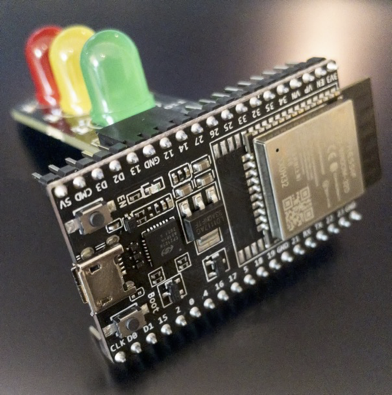

<p align="center">
 
 <h1 align="center">RIoT Dev Day 2022 Demo</h1>
  <p align="center">
    Toit Demo
    <br>
  </p>
</p>


Material used for [RIoT Dev Day 2022](https://riot.org/event/riot-developer-day-2022/) demo in the [Taking IoT Programming to a Higher Level](https://www.meetup.com/RIoT-NC/events/279446784/) presentation.

## Traffic Light Demo




[traffic-light.toit](source/traffic-light/traffic-light.toit) and [traffic-light.yaml](source/traffic-light/traffic-light.yaml) contain a Toit demo of a physical traffic light.


### traffic-light.toit

```
import gpio

class TrafficLight:
  redLight := gpio.Pin 14 --output
  yellowLight := gpio.Pin 27 --output
  greenLight := gpio.Pin 12 --output

  ON ::= 1
  OFF ::= 0  

  turnAllLightsOn: turnAllLights ON
  turnAllLightsOff: turnAllLights OFF

  turnAllLights number:
    redLight.set number
    yellowLight.set number
    greenLight.set number

  printAllLights:
    print "Red: $redLight"
    print "Yellow: $yellowLight"
    print "Green: $greenLight"

  runSequence:
    turnAllLightsOff
    redLight.set ON
    sleep --ms=2000
    yellowLight.set ON
    sleep --ms=1000
    redLight.set OFF
    yellowLight.set OFF
    greenLight.set ON
    sleep --ms=2000
    greenLight.set OFF
    yellowLight.set ON
    sleep --ms=1000
    yellowLight.set OFF

main:
  trafficLight := TrafficLight
  2.repeat:
    trafficLight.runSequence
```

### traffic-light.yaml

```yaml
name: "Traffic Light"
entrypoint: traffic-light.toit
triggers:
  on_boot: true
  on_install: true
```

## License
- The code is licensed under [MIT](LICENSE).
- The documentation is licensed under [CC BY-SA 4.0](http://creativecommons.org/licenses/by-sa/4.0/).
