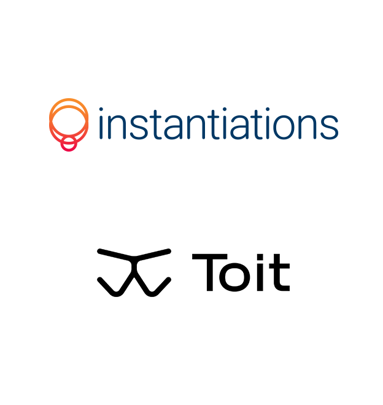

 
 <h1 align="center">RIoT Dev Day 2022 Demo</h1>
  

    Toit Demo
     
  

Material used for [RIoT Dev Day 2022](https://www.fast.org.ar/) demo in the [Taking IoT Programming to a Higher Level](https://www.meetup.com/RIoT-NC/events/279446784/) presentation.

## License
- The code is licensed under [MIT](LICENSE).
- The documentation is licensed under [CC BY-SA 4.0](http://creativecommons.org/licenses/by-sa/4.0/).
